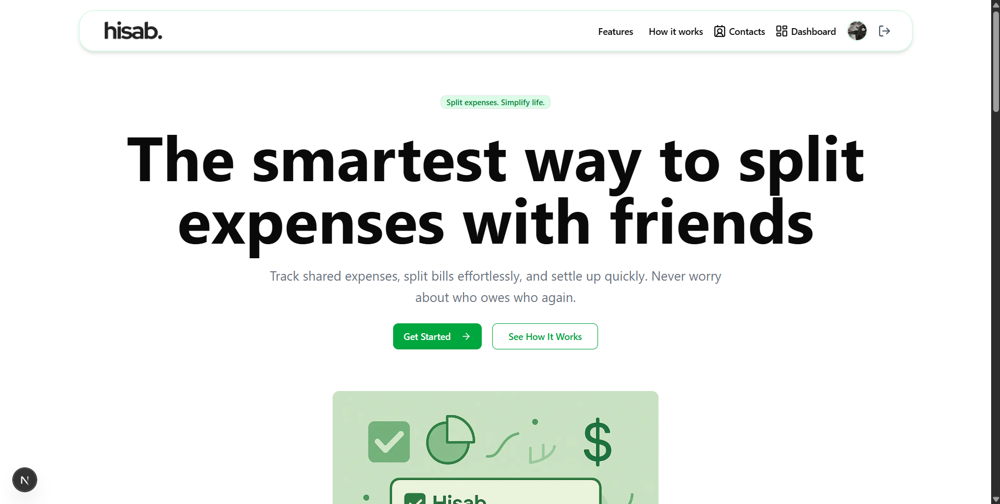

<div align="center">

<br />

# Hisab - Personal Expense Tracker 💰

An intelligent personal finance tracker to manage expenses, analyze spending with AI, and achieve your financial goals.

</div>

---

**Hisab** is a full-stack personal finance application designed to provide users with a seamless way to track their expenses. It leverages the power of AI to deliver personalized spending insights and sends automated monthly reports, helping you stay on top of your finances.



---

## ✨ Features

- **📊 Expense Tracking:** Log and categorize your daily expenses with an intuitive interface.
- **🤖 AI-Powered Insights:** Get smart analysis of your spending habits powered by the **Google Gemini API**.
- **📧 Automated Reports:** Receive beautiful, summarized monthly expense reports directly in your inbox via **Resend**.
- **🔄 Recurring Expenses:** Set up and automatically track recurring bills and subscriptions.
- **👥 Group Management:** Create groups to manage shared expenses with friends or family.
- **🖼️ Receipt Uploads:** Attach images of your receipts to expenses using **ImageKit** for better record-keeping.
- **📱 Responsive Design:** A clean, mobile-first design built with Next.js and Tailwind CSS.

---

## 🛠️ Tech Stack & Dependencies

This project is a full-stack MERN application with a few modern twists.

| Frontend (Next.js) | Backend (Node.js) |
|--------------------|-------------------|
| **Framework:** Next.js 15 | **Runtime:** Node.js |
| **Styling:** Tailwind CSS, clsx | **Framework:** Express.js |
| **UI Components:** Shadcn UI (Radix), Lucide Icons | **Database:** MongoDB with Mongoose |
| **Data Visualization:** Recharts | **Authentication:** JWT & bcryptjs |
| **API Client:** Axios | **AI:** Google Gemini API (`@google/genai`) |
| **Notifications:** Sonner, React Toastify | **Email:** Resend API |
| **State Management:** Next.js App Router | **File Uploads:** ImageKit & Multer |
| **Linting:** ESLint | **Scheduled Jobs:** `node-cron` |

---

## ⚙️ Getting Started

Follow these instructions to get a local copy up and running.

### Prerequisites

- **Node.js** (v18 or higher)
- **MongoDB** (A local instance or a free [MongoDB Atlas](https://www.mongodb.com/cloud/atlas) account)
- **API Keys** for:
  - Google Gemini
  - Resend
  - ImageKit

### Installation & Setup

1. **Clone the Repository**

   ```bash
   git clone https://github.com/yourusername/hisab.git
   cd hisab
   ````

2. **Setup Backend**

   ```bash
   cd backend
   npm install
   ```

   Create a `.env` file in the `backend` directory and fill it with your credentials (see the **Environment Variables** section below).

3. **Setup Frontend**

   ```bash
   cd ../frontend
   npm install
   ```

   Create a `.env.local` file in the `frontend` directory:

   ```env
   NEXT_PUBLIC_API_URL=http://localhost:8000
   ```

4. **Run the Application**

   Open two terminal windows.

   * In the first terminal, start the backend server:

     ```bash
     cd backend
     npm run dev
     ```

   * In the second terminal, start the frontend server:

     ```bash
     cd frontend
     npm run dev
     ```

   * Visit [http://localhost:3000](http://localhost:3000) in your browser.

---

## 🛡️ Environment Variables

Create a `.env` file in the `/backend` directory and add the following variables:

| Variable                | Description                                     |
| ----------------------- | ----------------------------------------------- |
| `PORT`                  | The port for the backend server (e.g., `8000`). |
| `MONGO_URL`             | Your MongoDB connection string.                 |
| `JWT_SECRET`            | A long, random string for signing JWT tokens.   |
| `GEMINI_API_KEY`        | Your API key for the Google Gemini service.     |
| `RESEND_API_KEY`        | Your API key for the Resend email service.      |
| `IMAGEKIT_URL_ENDPOINT` | Your ImageKit URL endpoint for file delivery.   |
| `IMAGEKIT_PUBLIC_KEY`   | Your public API key for ImageKit.               |
| `IMAGEKIT_PRIVATE_KEY`  | Your private API key for ImageKit.              |

---

## 🌐 API Endpoints

The backend exposes the following REST API endpoints:

| Endpoint           | Method | Description                                    | Protected |
| ------------------ | ------ | ---------------------------------------------- | :-------: |
| `/api/user/signup` | `POST` | Registers a new user.                          |     ❌     |
| `/api/user/login`  | `POST` | Logs in a user and returns a JWT.              |     ❌     |
| `/api/expenses`    | `POST` | Creates a new expense record.                  |     ✅     |
| `/api/expenses`    | `GET`  | Retrieves all expenses for the logged-in user. |     ✅     |
| `/api/dashboard`   | `GET`  | Fetches aggregated data for the dashboard.     |     ✅     |
| `/api/groups`      | `POST` | Creates a new expense group.                   |     ✅     |
| `/api/groups`      | `GET`  | Retrieves all groups for the logged-in user.   |     ✅     |

---

## 🤝 Contributing

Contributions make the open-source community an amazing place to learn, inspire, and create. Any contributions you make are **greatly appreciated**.

1. Fork the project
2. Create your feature branch (`git checkout -b feature/AmazingFeature`)
3. Commit your changes (`git commit -m 'Add some AmazingFeature'`)
4. Push to the branch (`git push origin feature/AmazingFeature`)
5. Open a Pull Request

### Show your support

Give a ⭐️ if this project helped you!

---

## 📧 Contact

**Kaushal Prakash**
**Discord:** `kaushalprakash`

```

