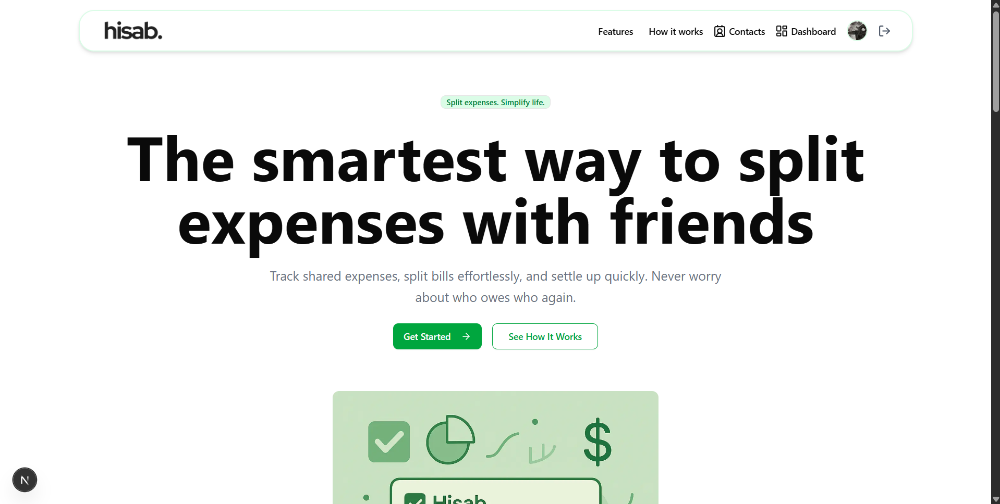

<div align="center">

<br />

# Hisab - Expense Splitting with AI 💸

A modern expense-splitting platform to manage shared finances with friends and family—powered by AI insights.

</div>

---

**Hisab** is a full-stack expense-splitting application, similar to Splitwise, designed to help users manage shared expenses, track balances, and gain insights into their spending behavior. With AI-powered analysis and automated reports, Hisab keeps your financial collaborations smooth and intelligent.



---

## ✨ Features

- **📊 Shared Expense Tracking:** Seamlessly log and split group expenses with others.
- **🤖 AI-Powered Insights:** Understand your spending behavior with analysis powered by the **Google Gemini API**.
- **📧 Automated Reports:** Get monthly summaries of your personal and group expenses delivered via **Resend**.
- **🔁 Recurring Expenses:** Auto-track subscriptions and recurring bills across groups.
- **👥 Group Management:** Create and manage groups to split rent, trips, or any shared expenses.
- **🖼️ Receipt Uploads:** Upload and attach receipts to expenses using **ImageKit** for better transparency.
- **📱 Responsive Design:** A clean, mobile-first design built with Next.js and Tailwind CSS.

---

## 🛠️ Tech Stack & Dependencies

This project is a full-stack MERN application with a few modern twists.

| Frontend (Next.js) | Backend (Node.js) |
|--------------------|-------------------|
| **Framework:** Next.js 15 | **Runtime:** Node.js |
| **Styling:** Tailwind CSS, clsx | **Framework:** Express.js |
| **UI Components:** Shadcn UI (Radix), Lucide Icons | **Database:** MongoDB with Mongoose |
| **Data Visualization:** Recharts | **Authentication:** JWT & bcryptjs |
| **API Client:** Axios | **AI:** Google Gemini API (`@google/genai`) |
| **Notifications:** Sonner, React Toastify | **Email:** Resend API |
| **State Management:** Next.js App Router | **File Uploads:** ImageKit & Multer |
| **Linting:** ESLint | **Scheduled Jobs:** `node-cron` |


---

## 🛡️ Environment Variables

Create a `.env` file in the `/backend` directory and add the following variables:

| Variable                | Description                                     |
| ----------------------- | ----------------------------------------------- |
| `PORT`                  | The port for the backend server (e.g., `8000`). |
| `MONGO_URL`             | Your MongoDB connection string.                 |
| `JWT_SECRET`            | A long, random string for signing JWT tokens.   |
| `GEMINI_API_KEY`        | Your API key for the Google Gemini service.     |
| `RESEND_API_KEY`        | Your API key for the Resend email service.      |
| `IMAGEKIT_URL_ENDPOINT` | Your ImageKit URL endpoint for file delivery.   |
| `IMAGEKIT_PUBLIC_KEY`   | Your public API key for ImageKit.               |
| `IMAGEKIT_PRIVATE_KEY`  | Your private API key for ImageKit.              |

---

## 🌐 API Endpoints

The backend exposes the following REST API endpoints:

| Endpoint           | Method | Description                                    | Protected |
| ------------------ | ------ | ---------------------------------------------- | :-------: |
| `/api/user/signup` | `POST` | Registers a new user.                          |     ❌     |
| `/api/user/login`  | `POST` | Logs in a user and returns a JWT.              |     ❌     |
| `/api/expenses`    | `POST` | Creates a new expense record.                  |     ✅     |
| `/api/expenses`    | `GET`  | Retrieves all expenses for the logged-in user. |     ✅     |
| `/api/dashboard`   | `GET`  | Fetches aggregated data for the dashboard.     |     ✅     |
| `/api/groups`      | `POST` | Creates a new expense group.                   |     ✅     |
| `/api/groups`      | `GET`  | Retrieves all groups for the logged-in user.   |     ✅     |

---

## 🐳 Docker Deployment

You can easily run the entire application locally using Docker Compose. Make sure you have Docker and Docker Compose installed on your system.

1. Ensure your `.env` file is set up in the `/backend` directory as described above.
2. Run the following command from the root of the project:

```bash
docker-compose up --build
```

3. The frontend will be available at `http://localhost:3000` and the backend will be accessible at `http://localhost:4000`.

---

## 🔄 Continuous Integration (CI)

This project uses **GitHub Actions** to automatically enforce code quality. 
A linting workflow runs on every push and pull request to the `main` or `master` branches, checking the `frontend` codebase for any linting errors.

---

## 🤝 Contributing

Contributions make the open-source community an amazing place to learn, inspire, and create. Any contributions you make are **greatly appreciated**.

1. Fork the project
2. Create your feature branch (`git checkout -b feature/AmazingFeature`)
3. Commit your changes (`git commit -m 'Add some AmazingFeature'`)
4. Push to the branch (`git push origin feature/AmazingFeature`)
5. Open a Pull Request

### Show your support

Give a ⭐️ if this project helped you!

---

## 📧 Contact

**Kaushal Prakash**
**Discord:** `kaushalprakash`

